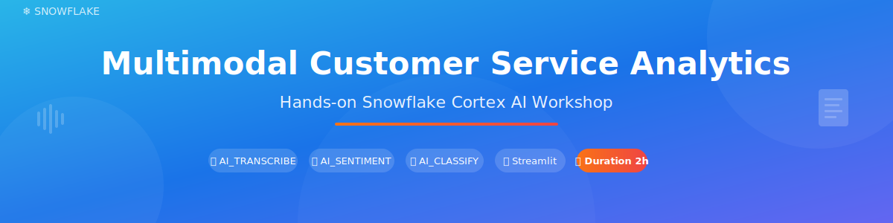

<p align="center">
  
</p>

# Lab Guide: Multimodal Customer Service Analytics

This step-by-step guide walks you through building an AI-powered customer service analytics system using Snowflake Cortex AI functions.

---

## Before You Begin

### Need a Snowflake account?

👉 **[Sign up for a free 30-day trial](https://signup.snowflake.com/)**

### Account Requirements

| Requirement | Details |
|-------------|---------|
| **Region** | Must be in a [supported Cortex region](https://docs.snowflake.com/en/user-guide/snowflake-cortex/llm-functions#label-cortex-llm-availability) |
| **Warehouse** | MEDIUM or larger recommended for audio processing |
| **Role** | `ACCOUNTADMIN` or equivalent privileges |

### Not in a supported region?

Run this command first to enable cross-region AI function access:
```sql
ALTER ACCOUNT SET CORTEX_ENABLED_CROSS_REGION = 'ANY_REGION';
```

---

## Lab Agenda

| Module | Topic | Duration |
|--------|-------|----------|
| 0 | Environment Setup | 10 min |
| 1 | Audio Processing Pipeline | 30 min |
| 2 | Document Processing | 15 min |
| 3 | Chat & Ticket Validation | 25 min |
| 4 | Build Streamlit Dashboard | 25 min |
| 5 | Explore & Interact | 15 min |
| **Total** | | **2 hours** |

---

<p align="center">
  
</p>

## Module 0: Environment Setup

**Duration: 10 minutes**

### What You'll Do
Set up the database, stages, and sample data needed for the lab.

### Steps

1. **Open Snowsight** and create a new SQL Worksheet

2. **Copy and run** the entire contents of [`setup.sql`](setup.sql)

3. **Verify setup** succeeded by checking these queries return data:
   ```sql
   SELECT COUNT(*) FROM DATA.audio_file_list;        -- Should return 5
   SELECT COUNT(*) FROM CHAT_LOGS;                   -- Should return 20
   SELECT COUNT(*) FROM SUPPORT_TICKETS;             -- Should return 20
   ```

4. **Verify stages** have files:
   ```sql
   LIST @CUSTOMER_CALLS;       -- Should show .mp3 files
   LIST @COMPANY_DOCUMENTS;    -- Should show .pdf files
   ```

### What This Created

| Object | Description |
|--------|-------------|
| `MULTIMODAL_CUSTOMER_SERVICE` | Database for the lab |
| `DATA` schema | Contains all tables and stages |
| `@CUSTOMER_CALLS` | Stage with 5 audio recordings |
| `@COMPANY_DOCUMENTS` | Stage with PDF documents |
| `CHAT_LOGS` | 20 customer chat transcripts |
| `SUPPORT_TICKETS` | 20 support tickets linked to chats |
| `transcription_results` | Empty table for storing processed calls |

---

<p align="center">
  
</p>

## Module 1: Audio Processing Pipeline

**Duration: 30 minutes**

### What You'll Learn
- Convert audio files to text with `AI_TRANSCRIBE`
- Translate conversations with `AI_TRANSLATE`
- Detect sentiment with `AI_SENTIMENT`
- Classify issues with `AI_CLASSIFY`
- Generate summaries with `AI_COMPLETE`

### Steps

1. **Import the notebook**:
   - Download [`notebook.ipynb`](notebook.ipynb)
   - In Snowsight: **Projects** → **Notebooks** → **Import .ipynb file**
   - Select database: `MULTIMODAL_CUSTOMER_SERVICE`, schema: `DATA`

2. **Run Step 0: Explore Data** cells to see what you're working with

3. **Run the Complex Pipeline** cell (first code cell in Part 1)
   - This chains all 6 AI functions together
   - ⏱️ Takes ~2-3 minutes for 5 audio files

4. **Work through each AI function** step by step:
   - `AI_TRANSCRIBE` → Converts audio to text with speaker segments
   - `FLATTEN` → Combines segments into full conversation
   - `AI_TRANSLATE` → Translates to English (auto-detects source)
   - `AI_SENTIMENT` → Classifies as positive/negative/neutral/mixed
   - `AI_CLASSIFY` → Assigns to one of 5 business categories
   - `AI_COMPLETE` → Generates 50-word summary

5. **View results**:
   ```sql
   SELECT file_name, sentiment_label, call_category, call_summary 
   FROM transcription_results;
   ```

### Key Concepts

**AI_TRANSCRIBE output structure:**
```json
{
  "audio_duration": 45.2,
  "segments": [
    {"speaker": "SPEAKER_00", "text": "Hello...", "start": 0.0, "end": 2.1},
    {"speaker": "SPEAKER_01", "text": "I have an issue...", "start": 2.5, "end": 8.3}
  ]
}
```

**AI_CLASSIFY categories used:**
1. 🔒 Fraud & Security Issues
2. 🖥️ Technical & System Errors
3. 💳 Payment & Transaction Problems
4. 📝 Account Changes & Modifications
5. ❓ General Inquiries & Information Requests

---

<p align="center">
  
</p>

## Module 2: Document Processing

**Duration: 15 minutes**

### What You'll Learn
- Extract structured content from PDFs with `AI_PARSE_DOCUMENT`

### Steps

1. **Run the PARSE_DOCUMENTS cell** in Part 2 of the notebook

2. **Explore the output**:
   ```sql
   SELECT file_name, parsed_result:content::VARCHAR AS content
   FROM parsed_documents_raw
   LIMIT 1;
   ```

3. **Understand the parameters**:
   - `mode: 'LAYOUT'` - Preserves document structure
   - `page_split: TRUE` - Returns content page by page

### Use Cases
- Policy documents → Extract terms and conditions
- Invoices → Pull line items and totals
- Contracts → Identify key clauses

---

<p align="center">
  
</p>

## Module 3: Chat & Ticket Validation

**Duration: 25 minutes**

### What You'll Learn
- Validate agent classifications with AI
- Extract structured data with `AI_EXTRACT`
- Cross-reference tickets and chats with `AI_COMPLETE`

### Steps

1. **Run PROCESS_CHAT_LOGS** cell in Part 3
   - Re-classifies chats using `AI_CLASSIFY`
   - Re-analyzes sentiment using `AI_SENTIMENT`
   - Extracts structured fields using `AI_EXTRACT`
   - Flags mismatches between agent labels and AI analysis

2. **Check flagged chats**:
   ```sql
   SELECT chat_id, self_reported_category, ai_classified_category, flag_reasons
   FROM chat_validation_results
   WHERE is_flagged = TRUE;
   ```

3. **Run ALIGN_CHAT_LOG_WITH_SUPPORT_TICKETS** cell in Part 4
   - Uses `AI_COMPLETE` to semantically compare ticket and chat
   - Returns alignment status, confidence, and reasoning

4. **Review misalignments**:
   ```sql
   SELECT ticket_number, alignment_status, alignment_reason, misalignment_severity
   FROM ticket_chat_alignment
   WHERE alignment_status = 'misaligned';
   ```

### AI_EXTRACT Schema Used
```sql
AI_EXTRACT(
    text => full_conversation,
    responseFormat => OBJECT_CONSTRUCT(
        'issue_description', 'What is the main issue?',
        'product_name', 'What product is mentioned?',
        'error_message', 'What error code is mentioned?',
        'resolution_provided', 'What solution was given?',
        'customer_satisfaction_indicator', 'Is customer satisfied?',
        'urgency_level', 'How urgent is this?'
    )
)
```

---

<p align="center">
  
</p>

## Module 4: Build Streamlit Dashboard

**Duration: 25 minutes**

### What You'll Build
An interactive dashboard showing:
- KPI metrics (calls processed, chats flagged, misalignments)
- Sentiment and category distributions
- Call summaries browser
- Flagged chat explorer
- Alignment issue viewer

### Steps

1. **Create a new Streamlit app**:
   - In Snowsight: **Projects** → **Streamlit** → **+ Streamlit App**
   - Name: `Customer Service Analytics`
   - Database: `MULTIMODAL_CUSTOMER_SERVICE`
   - Schema: `DATA`
   - Warehouse: Your warehouse

2. **Replace the default code** with the contents of [`streamlit_app.py`](streamlit_app.py)

3. **Click Run** to launch the app

4. **Explore the tabs**:
   - **Overview**: KPI cards and distribution charts
   - **Call Analytics**: Browse processed calls with summaries
   - **Chat Validation**: See flagged chats and mismatches
   - **Alignment Issues**: Review ticket-chat discrepancies

### Dashboard Features

| Tab | What It Shows |
|-----|---------------|
| Overview | KPI metrics, sentiment chart, category chart |
| Call Analytics | Expandable cards with call summaries |
| Chat Validation | Filterable table of validation results |
| Alignment Issues | Severity-sorted list of misaligned tickets |

---

<p align="center">
  
</p>

## Module 5: Explore & Interact

**Duration: 15 minutes**

### Exercises

1. **Modify the classification categories**
   - Edit the `AI_CLASSIFY` call to use your own business categories
   - Re-run on the chat data

2. **Try different LLM models**
   - Replace `'claude-sonnet-4-5'` with `'llama3.1-70b'` or `'mistral-large2'`
   - Compare summary quality

3. **Create a new validation rule**
   - Add a check for high-urgency tickets with neutral sentiment

4. **Explore the raw data**
   - Look at the `segments` column to see speaker diarization
   - Examine `extracted_features` JSON structure

---

## Troubleshooting

### "Function AI_TRANSCRIBE does not exist"
Your account may not be in a supported Cortex region. Run:
```sql
ALTER ACCOUNT SET CORTEX_ENABLED_CROSS_REGION = 'ANY_REGION';
```

### Transcription is slow
Audio processing is compute-intensive. Use a MEDIUM or larger warehouse. Expected: ~30-60 seconds per audio file.

### No data in dashboard
Make sure you've run the notebook cells first to populate the results tables.

### Streamlit permission errors
Ensure your role has:
- `USAGE` on the database and schema
- `SELECT` on all tables
- `USAGE` on the warehouse

---

## Clean Up

To remove all lab resources:

```sql
DROP DATABASE IF EXISTS MULTIMODAL_CUSTOMER_SERVICE;
```

---

## Congratulations! 🎉

You've built a complete multimodal customer service analytics system that:

✅ Transcribes audio calls to searchable text  
✅ Translates conversations to English automatically  
✅ Detects customer sentiment  
✅ Classifies issues into business categories  
✅ Generates AI summaries  
✅ Parses PDF documents  
✅ Validates agent classifications  
✅ Cross-references tickets and chats  
✅ Displays insights in an interactive dashboard  

### Next Steps
- Connect your own audio files and documents
- Customize categories for your business domain
- Add scheduling with Snowflake Tasks for continuous processing
- Build a Cortex Agent for natural language queries

---

## Resources

- [Snowflake Free Trial](https://signup.snowflake.com/)
- [Cortex AI Functions Documentation](https://docs.snowflake.com/en/sql-reference/functions-ai)
- [Streamlit in Snowflake Guide](https://docs.snowflake.com/en/developer-guide/streamlit/about-streamlit)
- [Snowflake Notebooks](https://docs.snowflake.com/en/user-guide/ui-snowsight/notebooks)
- [Original Quickstart](https://quickstarts.snowflake.com/guide/extracting-insights-from-multimodal-customer-data/)
